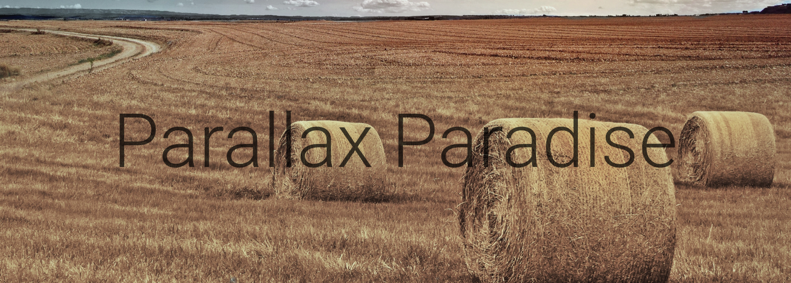
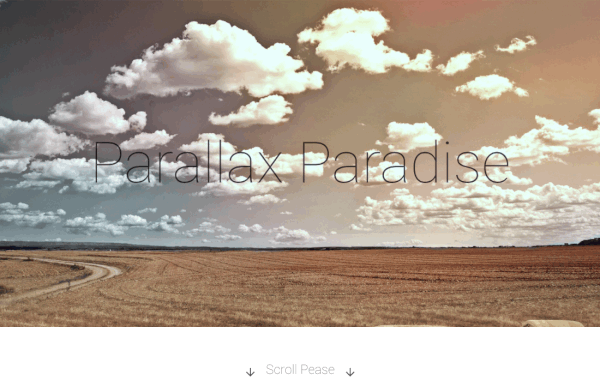

# Parallax Paradise

 
Démonstration technique d’effet de parallaxe sur le titre d’une large entête à fond fixe. D’une apparente simplicité, l’animation, sobre et moderne, donne une impression de finition sophistiqué. Cette effet donne une grâce dynamique a une entête graphique.

## Details

Animation du titre de l’entête sur une image fixe en pleine largeur. Une image valant mieux que 100 mots… (cf gif animé).
Cet effet de parallaxe en plus de donnez du dynamisme permet d'afficher plus longtemps le titre inclus dans l'entête.

## Police de caractère
 
**Roboto**, moderne et sans empâtements, cette police se marie parfaitement avec la simplicité et l’impact des effets de parallaxe.

## GitHub
 
**Repository**: [https://github.com/iStuffs/parallax-paradise](https://github.com/iStuffs/parallax-paradise)
**Demo**: [http://istuffs.github.io/parallax-paradise/](http://istuffs.github.io/parallax-paradise/)

---
©iStuffs